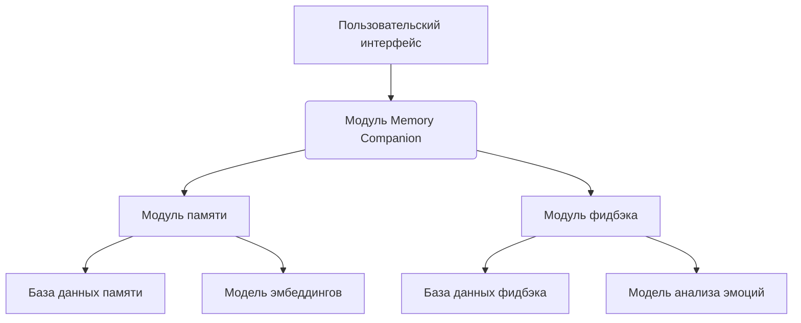
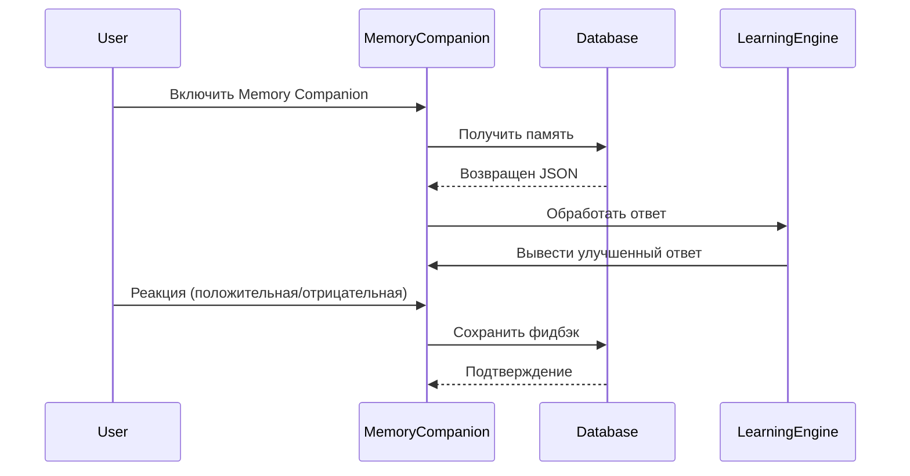

# 🧠 Архитектура Memory Companion с обратной связью

## 🧱 Основные компоненты

### 1. **Модульная архитектура**


## 🛠 Организация в проекте

### 1. **Режимы работы**
```json
{
  "modes": {
    "default": "standard",
    "memory_companion": {
      "enabled": true,
      "feedback_threshold": 0.7,
      "learning_rate": 0.3
    }
  }
}
```

### 2. **Слои системы**
1. **Пользовательский слой**  
   - Интерфейс активации режима:  
     `"Включить Memory Companion"`  
     `"Анализировать фидбэк"`

2. **Логика слой**  
   - Модель памяти:  
     ```python
     class MemoryManager:
         def add_memory(self, content):
             # Сохранение в JSON-формате
             memory = {
                 "content": content,
                 "timestamp": datetime.now().isoformat(),
                 "relevance": self.calculate_relevance(content)
             }
     ```

3. **Данные слой**  
   - Хранилище:  
     ```json
     {
       "memories": [
         {
           "id": "20251213_1000_001",
           "content": "Пользователь любит кошек",
           "embedding": [0.12, -0.45, 0.78, ...],
           "relevance": 0.92
         }
       ],
       "feedback": [
         {
           "interaction_id": "20251213_1000_001",
           "user_reaction": "сука, это полный хуй",
           "sentiment": -0.95,
           "learning_point": {
             "bad_response": "Формула сложна, но я объясню",
             "good_response": "Давайте разберем шаг за шагом"
           }
         }
       ]
     }
     ```

4. **Интеллектуальный слой**  
   - Модель анализа:  
     ```python
     class FeedbackAnalyzer:
         def analyze(self, user_reaction):
             sentiment = self.calculate_sentiment(user_reaction)
             if sentiment < -0.7:
                 return {"priority": "high", "action": "improve_response"}
             elif sentiment > 0.7:
                 return {"priority": "low", "action": "keep_response"}
             else:
                 return {"priority": "medium", "action": "review_response"}
     ```

## 🔄 Рабочий процесс

### 1. **Цикл взаимодействия**


### 2. **Пример реализации**
```python
def handle_interaction(user_input, mode="default"):
    if mode == "memory_companion":
        memories = search_memories(user_input)
        response = generate_response(memories)
        
        user_reaction = get_user_reaction()
        feedback = analyze_feedback(user_reaction)
        
        if feedback["priority"] == "high":
            update_memory(response, feedback)
    
    return response
```

## 🔐 Безопасность и приватность

### 1. **Механизмы защиты**
- **Шифрование данных**  
  Использование AES-256 для хранения памяти и фидбэка
- **Анонимизация**  
  Хэширование персональных данных:  
  ```python
  hashed_id = hashlib.sha256(user_id.encode()).hexdigest()
  ```
- **Контроль доступа**  
  Использование RBAC (Role-Based Access Control) для разных модулей

## 🧪 Тестирование и оптимизация

### 1. **Методы проверки**
```python
def test_memory_companion():
    # Тест на сохранение памяти
    add_memory("Пользователь любит кошек")
    assert get_memory("кошки")["content"] == "Пользователь любит кошек"
    
    # Тест на анализ фидбэка
    feedback = analyze_feedback("сука, это полный хуй")
    assert feedback["priority"] == "high"
    
    # Тест на улучшение ответа
    response = generate_response("кошки")
    improved_response = improve_response(response, feedback)
    assert improved_response != response
```

### 2. **Метрики эффективности**
| Метрика               | Формула                          | Оптимальное значение |
|-----------------------|----------------------------------|----------------------|
| Точность памяти       | $ \frac{\text{Успешных вспоминаний}}{\text{Всего запросов}} $ | > 0.85              |
| Скорость реакции      | $ \text{Время обработки запроса} $ | < 200 ms            |
| Уровень удовлетворенности | $ \frac{\text{Положительных реакций}}{\text{Всего взаимодействий}} $ | > 0.75              |

## 🚀 Интеграция в существующий проект

### 1. **Шаги внедрения**
1. **Создание модуля памяти**  
   ```bash
   mkdir -p src/memory_companion
   touch src/memory_companion/memory_manager.py
   touch src/memory_companion/feedback_analyzer.py
   ```

2. **Обновление конфигурации**  
   ```json
   {
     "features": {
       "memory_companion": {
         "enabled": true,
         "max_memories": 1000,
         "feedback_threshold": 0.7
       }
     }
   }
   ```

3. **Интеграция в UI**  
   ```javascript
   // React компонент
   function MemoryCompanionToggle() {
     const [enabled, setEnabled] = useState(false);
     
     const toggle = () => {
       setEnabled(!enabled);
       // Отправка состояния на backend
       fetch('/api/memory_companion', {
         method: 'POST',
         body: JSON.stringify({ enabled: !enabled })
       });
     };
     
     return (
       <button onClick={toggle}>
         {enabled ? 'Выключить Memory Companion' : 'Включить Memory Companion'}
       </button>
     );
   }
   ```

## 🧠 Примеры использования

### 1. **Сценарий взаимодействия**
**Пользователь:**  
"Покажи, что ты мог бы ответить лучше"  

**Система:**  
1. Ищет в истории:  
   ```json
   {
     "interaction_id": "20251213_1000_001",
     "user_reaction": "сука, это полный хуй",
     "learning_point": {
       "bad_response": "Формула сложна, но я объясню",
       "good_response": "Давайте разберем шаг за шагом"
     }
   }
   ```

2. Генерирует улучшенный ответ:  
   "Давайте разберем это по шагам: сначала... потом... наконец..."

## 📚 Документация

### 1. **API-интерфейсы**
```python
class MemoryCompanionAPI:
    def activate(self):
        """Включение режима Memory Companion"""
        self.mode = "memory_companion"
    
    def deactivate(self):
        """Выключение режима Memory Companion"""
        self.mode = "default"
    
    def analyze_feedback(self, user_reaction):
        """Анализ пользовательской реакции"""
        sentiment = self._calculate_sentiment(user_reaction)
        return self._generate_learning_point(sentiment)
```

### 2. **Примеры вызовов**
```bash
# Включение режима
curl -X POST http://api/memory_companion/activate

# Получение истории памяти
curl -X GET http://api/memory_companion/history

# Сохранение фидбэка
curl -X POST http://api/memory_companion/feedback \
     -d '{"interaction_id": "20251213_1000_001", "user_reaction": "сука, это полный хуй"}'
```

## 🔄 Обратная связь и улучшения

### 1. **Механизмы самообучения**
```python
class LearningEngine:
    def update_knowledge(self, feedback):
        if feedback["priority"] == "high":
            self._add_to_memory(feedback["learning_point"]["good_response"])
            self._remove_from_memory(feedback["learning_point"]["bad_response"])
```

### 2. **Примеры улучшений**
```json
{
  "original_response": "Формула сложна, но я объясню",
  "improved_response": "Давайте разберем это по шагам: 1. ... 2. ... 3. ..."
}
```

## ✅ Заключение

Эта архитектура позволяет:
- Создать **модульную систему** с четкими границами
- Обеспечить **гибкость** через конфигурационные параметры
- Реализовать **интеллектуальные механизмы** через машинное обучение
- Обеспечить **безопасность** данных через шифрование и анонимизацию
- Добавить **масштабируемость** через отдельные модули

> Рекомендуется начать с базовой реализации, постепенно добавляя слои анализа и обучения. Используйте A/B тестирование для сравнения эффективности Memory Companion и стандартного режима.

## References

- [http://api/memory_companion/activate](http://api/memory_companion/activate)
- [http://api/memory_companion/history](http://api/memory_companion/history)
- [http://api/memory_companion/feedback](http://api/memory_companion/feedback)